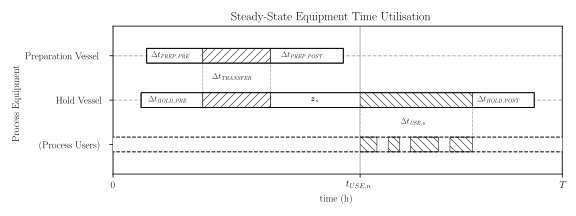

Problem definition
------------------

The sections below detai lthe "complete" problem. Other problem variants are
the "basic" and "minimized hold time" variants, which are discussed afterwards.

Given
~~~~~

Data on buffers e.g.

.. list-table:: 
   :widths: 10, 20, 20, 20, 20
   :header-rows: 2

   * - indices
     - names
     - volumes
     - use start times
     - use_durations
   * - :math:`n`
     - :math:`\hbox{--}`
     - :math:`U_{n}`
     - :math:`t_{\mathit{USE},n}^{*}`
     - :math:`\Delta t_{\mathit{USE},n}`
   * - 0
     - Buffer #1
     - 5825.23
     - 62.86
     - 39.16
   * - 1
     - Buffer #2
     - 10214.75
     - 79.63
     - 25.5
   * - 2
     - Buffer #3
     - 13995.95
     - 17.6
     - 61.7
   * - 3
     - Buffer #4
     - 14619.52
     - 74.28
     - 44.19
   * - 4
     - Buffer #5
     - 4504.94
     - 29.73
     - 36.0
   * - 5
     - Buffer #6
     - 16361.95
     - 5.5
     - 38.78
   * - 6
     - Buffer #7
     - 3464.09
     - 38.25
     - 57.93
   * - 7
     - Buffer #8
     - 13387.42
     - 11.35
     - 36.55
   * - 8
     - Buffer #9
     - 1064.93
     - 61.21
     - 45.84
   * - 9
     - Buffer #10
     - 1654.58
     - 34.88
     - 22.03
   * - 10
     - Buffer #11
     - 23631.53
     - 26.26
     - 37.99
   * - 11
     - Buffer #12
     - 11546.57
     - 94.15
     - 56.41

Data on available vessels

.. list-table:: 
   :widths: 10, 20, 20, 20
   :header-rows: 2

   * - indices
     - names
     - volumes
     - costs
   * - :math:`m`
     - :math:`\hbox{--}`
     - :math:`V_{m}`
     - :math:`c_{m}`
   * - 0
     - 1000 L
     - 1000.0
     - 63.10
   * - 1
     - 2000 L
     - 2000.0
     - 95.64
   * - 2
     - 3000 L
     - 3000.0
     - 121.98
   * - 3
     - 4000 L
     - 4000.0
     - 144.96
   * - 4
     - 5000 L
     - 5000.0
     - 165.72
   * - 5
     - 6000 L
     - 6000.0
     - 184.88
   * - 6
     - 8000 L
     - 8000.0
     - 219.71
   * - 7
     - 10000 L
     - 10000.0
     - 251.19
   * - 8
     - 12000 L
     - 12000.0
     - 280.23
   * - 9
     - 16000 L
     - 16000.0
     - 333.02
   * - 10
     - 18000 L
     - 18000.0
     - 357.41
   * - 11
     - 20000 L
     - 20000.0
     - 380.73
   * - 12
     - 22000 L
     - 22000.0
     - 403.14
   * - 13
     - 25000 L
     - 25000.0
     - 435.28
   * - 14 
     - 30000 L
     - 30000.0
     - 485.59

And some additional parameters:

.. list-table:: 
   :widths: 20, 10, 20
   :header-rows: 1

   * - parameter
     - symbol
     - value
   * - process cycle time (h)
     - :math:`T`
     - 96.0
   * - prep pre duration (h)
     - :math:`\Delta t_{\mathit{PREP,PRE}}`
     - 12.0
   * - prep post duration (h)
     - :math:`\Delta t_{\mathit{PREP,POST}}`
     - 1.5
   * - transfer duration (h)
     - :math:`\Delta t_{\mathit{TRANSFER}}`
     - 2.0
   * - hold pre duration (h)
     - :math:`\Delta t_{\mathit{HOLD,PRE}}`
     - 8.0
   * - hold post duration (h)
     - :math:`\Delta t_{\mathit{HOLD,POST}}`
     - 1.5
   * - minimum hold duration (h)
     - :math:`\Delta t_{\mathit{HOLD,MIN}}`
     - 12.0
   * - maximum hold duration (h)
     - :math:`\Delta t_{\mathit{HOLD,MAX}}`
     - 60.0
   * - vessel minimum fill ratio
     - :math:`f_{\mathit{MINUSE}}`
     - 0.3
   * - maximum prep utilization
     - :math:`f_{\mathit{MAXUSE}}`
     - 0.8
   * - max slots
     - :math:`P`
     - 5

Support formulae:

.. math::
    m \in \mathcal{M}; \quad \mathcal{M} = \left\{ 0, 1, 2, \ldots, m, \ldots,
    \left( M - 1 \right) \right\}

.. math::
    n \in \mathcal{N}; \quad \mathcal{N} = \left\{ 0, 1, 2, \ldots, n, \ldots,
    \left( N - 1 \right) \right\}

.. math::
    p \in \mathcal{P}; \quad \mathcal{P} = \left\{ 0, 1, 2, \ldots, p, \ldots,
    \left( P - 1 \right) \right\}

.. math::
    M = |\mathcal{M}|

.. math::
    N = |\mathcal{N}|

.. math::
    P = |\mathcal{P}|

.. math::
    t_{\mathit{USE},n} = t_{\mathit{USE},n}^{*} \enspace \text{mod} \enspace 
    T \quad \forall n \in \mathcal{N}

.. math::
    V_{\mathit{MAX}} = \text{max} \left( V_{m} \enspace \forall m \in
    \mathcal{M} \right)

.. math::
    \Delta t_{\mathit{PREP}} = \Delta t_{\mathit{PREP,PRE}} + 
    \Delta t_{\mathit{TRANSFER}} + \Delta t_{\mathit{PREP,POST}}

Minimize
~~~~~~~~

The total (relative) cost of buffer preparation vessels

.. math::
    \boldsymbol{Z} = \sum_{m \in \mathcal{M}} \sum_{p \in \mathcal{P}} c_m
    \boldsymbol{y}_{mp}

Subject to
~~~~~~~~~~

Each buffer must be prepared in a defined slot

.. math::
    \sum_{p \in \mathcal{P}} \boldsymbol{x}_{np} = 1 \quad \forall n \in 
    \mathcal{N}

Each slot may contain at most one vessel

.. math::
    \sum_{m \in \mathcal{M}} \boldsymbol{y}_{mp} \le 1 \quad \forall p \in 
    \mathcal{P}

Each vessel must be sufficiently large to prepare allocated buffers

.. math::
    U_{n} \boldsymbol{x}_{np} - \sum_{m \in \mathcal{M}} V_{m} 
    \boldsymbol{y}_{mp} \le 0 \quad \forall n \in \mathcal{N}, \enspace 
    \forall p \in \mathcal{P}

Each vessel must be sufficiently small to prepare allcoated buffers

.. math::
    V_{\mathit{MAX}} \boldsymbol{x}_{np} + f_{\mathit{MINFILL}} 
    \sum_{m \in \mathcal{M}} V_{m} \boldsymbol{y}_{mp} \le U_{n}
    + V_{\mathit{MAX}} \quad \forall n \in \mathcal{N}, \enspace \forall p \in
    \mathcal{P}

Each preapration vessel must have a utilization below the maximum utilization
limit

.. math::
    \Delta t_{\mathit{PREP}} \sum_{n \in \mathcal{N}} \boldsymbol{x}_{np} \le
    f_{\mathit{UTIL}} T \quad \forall p \in \mathcal{P}

The total duration in each hold vessel must be less than the cycle time

.. math::
    \begin{aligned}
        \boldsymbol{z}_{n} \le T - \Delta t_{\mathit{HOLD,PRE}}
        - \Delta t_{\mathit{TRANSFER}} - \Delta t_{\mathit{USE},n}
        - \Delta t_{\mathit{HOLD,POST}}\\
        \quad \forall n \in \mathcal{N}
    \end{aligned}

Buffer preparation procedures mustn't clash with one another

.. math::
    \begin{split}
        \begin{alignedat}{11}
            2&\boldsymbol{w}_{nkp} {}-{} &&\boldsymbol{x}_{np}
            {}-{} && \boldsymbol{x}_{kp} {}&&\le{} &{}-{} 2\\
            &\boldsymbol{w}_{nkp} {}-{} &&\boldsymbol{x}_{np}
            {}-{} && \boldsymbol{x}_{kp} {}&&\ge{} &{}-{} 1\\
        \end{alignedat}
    \end{split}
    \quad
    \begin{split}
        \forall n \in \mathcal{N}, \enspace \forall k \in \mathcal{N}; \; 
        k > n, \enspace \forall p \in \mathcal{P}
    \end{split}

.. math::
    \begin{split}
        \begin{alignedat}{2}
            T \boldsymbol{q}_{n} - \boldsymbol{z}_{n} &\ge
            - t_{\mathit{USE},n}\\
            T \boldsymbol{q}_{n} - \boldsymbol{z}_{n} &\le
            - t_{\mathit{USE},n} + T\\
        \end{alignedat}
    \end{split}
    \quad \forall n \in \mathcal{N}

.. math::
        \begin{split}
        \begin{alignedat}{2}
            -T \boldsymbol{q}_{n} + T \boldsymbol{r}_{n} + \boldsymbol{z}_{n}
            &\le t_{\mathit{USE},n} + \Delta t_{\mathit{PREP}}\\
            -T \boldsymbol{q}_{n} + T \boldsymbol{r}_{n} + \boldsymbol{z}_{n}
            &\ge t_{\mathit{USE},n} + \Delta t_{\mathit{PREP}} - T\\
            \end{alignedat}
        \quad \forall n \in \mathcal{N}
    \end{split}

.. math::
    \begin{split}
        \begin{alignedat}{2}
            T \boldsymbol{q}_{n} + T \boldsymbol{s}_{n} - \boldsymbol{z}_{n}
            &\le -t_{\mathit{USE},n} + \Delta t_{\mathit{PREP}}\\
            T \boldsymbol{q}_{n} + T \boldsymbol{s}_{n} - \boldsymbol{z}_{n}
            &\ge -t_{\mathit{USE},n} + \Delta t_{\mathit{PREP}} + T\\
            \end{alignedat}
        \quad \forall n \in \mathcal{N}
    \end{split}

.. math::
    \begin{split}
        \begin{alignedat}{8}
            &&\boldsymbol{r}_{n} && {}+{} &&\boldsymbol{s}_{n} && {}-{} 
            &&\boldsymbol{u}_{n} &\ge 0\\
            &&\boldsymbol{r}_{n} && {}+{} &&\boldsymbol{s}_{n} && {}-{} 
            &2&\boldsymbol{u}_{n} &\le 0\\
        \end{alignedat}
        \quad \forall n \in \mathcal{N}
    \end{split}

.. math::
    \begin{split}
        \begin{aligned}
            T \boldsymbol{q}_{k} - T \boldsymbol{q}_{n} - 2T \boldsymbol{u}_{n} 
            + 2T \boldsymbol{v}_{nk} + 2T \sum_{p \in \mathcal{P}}
            \boldsymbol{w}_{nkp} - \boldsymbol{z}_{k} + \boldsymbol{z}_{n}\\
            \le t_{\mathit{USE},n} - t_{\mathit{USE},k}
            - \Delta t_{\mathit{PREP}} + 4T
        \end{aligned}\\
        \begin{aligned}
            T \boldsymbol{q}_{k} - T \boldsymbol{q}_{n} + 2T \boldsymbol{u}_{n} 
            + 2T \boldsymbol{v}_{nk} - 2T \sum_{p \in \mathcal{P}}
            \boldsymbol{w}_{nkp} - \boldsymbol{z}_{k} + \boldsymbol{z}_{n}\\
            \ge t_{\mathit{USE},n} - t_{\mathit{USE},k}
            + \Delta t_{\mathit{PREP}} - 2T
        \end{aligned}\\
        \begin{aligned}
            T \boldsymbol{q}_{k} - T \boldsymbol{q}_{n} - T \boldsymbol{r}_{n}
            + 2T \boldsymbol{u}_{n} + 2T \sum_{p \in \mathcal{P}}
            \boldsymbol{w}_{nkp} - \boldsymbol{z}_{k} + \boldsymbol{z}_{n}\\
            \le t_{\mathit{USE},n} - t_{\mathit{USE},k}
            - \Delta t_{\mathit{PREP}} + 4T
        \end{aligned}\\
        \begin{aligned}
            T \boldsymbol{q}_{k} - T \boldsymbol{q}_{n} + T \boldsymbol{s}_{n}
            - 2T \boldsymbol{u}_{n} - 2T \sum_{p \in \mathcal{P}}
            \boldsymbol{w}_{nkp} - \boldsymbol{z}_{k} + \boldsymbol{z}_{n}\\
            \ge t_{\mathit{USE},n} - t_{\mathit{USE},k}
            + \Delta t_{\mathit{PREP}} - 4T
        \end{aligned}\\
        \begin{aligned}
            \forall n \in \mathcal{N}, \enspace \forall k \in \mathcal{N}; \;
            k > n
        \end{aligned}\\
    \end{split}

Where
~~~~~

The following decision variables are specified.

.. math::
    \boldsymbol{q}_{n} \in \left\{0, 1\right\} \quad \forall n \in \mathcal{N}

.. math::
    \boldsymbol{r}_{n} \in \left\{ 0, 1 \right\} \quad \forall n \in
    \mathcal{N}

.. math::
    \boldsymbol{s}_{n} \in \left\{ 0, 1 \right\} \quad \forall n \in
    \mathcal{N}

.. math::
    \boldsymbol{u}_{n} \in \left\{ 0, 1 \right\} \quad \forall n \in
    \mathcal{N}

.. math::
    \boldsymbol{v}_{nk} \in \left\{ 0, 1 \right\} \quad \forall n \in
    \mathcal{N}, \enspace \forall k \in \mathcal{N}; \; k > n

.. math::
    \boldsymbol{w}_{nkp} \in \left\{ 0, 1 \right\} \quad \forall n \in
    \mathcal{N}, \enspace \forall k \in \mathcal{N}; \; k > n, \enspace \forall
    p \in \mathcal{P}

.. math::
    \boldsymbol{x}_{np} \in \left\{ 0, 1 \right\} \quad \forall n \in
    \mathcal{N}, \enspace \forall p \in \mathcal{P}

.. math::
    \boldsymbol{y}_{mp} \in \left\{ 0, 1 \right\} \quad \forall m \in
    \mathcal{M}, \enspace \forall p \in \mathcal{P}

.. math::
    \Delta t_{\mathit{HOLD,MIN}} \le \boldsymbol{z}_{n} \le 
    \Delta t_{\mathit{HOLD,MAX}}; \quad
    \boldsymbol{z}_{n} \in \mathbb{R} \quad \forall n \in \mathcal{N}

Variant Problems
----------------

Basic
~~~~~

The "basic" variant omits the buffer preparation scheduling constraints and 
as such does not compute a workable schedule. It merely calculates the vessels
required to maintain the specified utilization ratio at minimum cost.

Minimized Hold Time
~~~~~~~~~~~~~~~~~~~

The "minimized hold time" variant involves two rounds of optimization.
Firstly, the "complete" problem is solved, resulting in a minimum cost.

Next, the optimum (minimized) cost is set as a constraint:

.. math::
    Z^{\prime} = \min \boldsymbol{Z}
    \label{eq.Zprime}

.. math::
    \sum_{m \in \mathcal{M}} \sum_{p \in \mathcal{P}} c_m \boldsymbol{y}_{mp}
    = Z^{\prime}

Then the problem is re-run with the following objective to be minimized:

.. math::
    \boldsymbol{Y} = \sum_{n \in \mathcal{N}} \boldsymbol{z}_{n}

Nomenclature
------------

.. list-table:: 
   :widths: 20 80
   :header-rows: 1

   * - Symbol
     - Description
   * - :math:`\boldsymbol{a}_{nk}`
     - buffers :math:`n` and :math:`k` prepared in same vessel (binary)
   * - :math:`c_{m}`
     - (relative) cost of vessel :math:`m`
   * - :math:`f_{\mathit{MAXUSE}}`
     - buffer maximum use duration ratio
   * - :math:`f_{\mathit{MINFILL}}`
     - vessel minimum fill ratio
   * - :math:`f_{\mathit{MINUSE}}`
     - buffer minimum use duration ratio
   * - :math:`f_{\mathit{UTIL}}`
     - preparation slot maximum utilisation ratio
   * - :math:`k`
     - secondary buffer index :math:`\left( k \in \mathcal{N}, k \ne n \right)`
   * - :math:`m`
     - vessel size index :math:`\left( m \in \mathcal{M} \right)`
   * - :math:`n`
     - buffer index :math:`\left( n \in \mathcal{N} \right)`
   * - :math:`p`
     - slot index :math:`\left( p \in \mathcal{P} \right)`
   * - :math:`\boldsymbol{q}_{n}`
     - the buffer :math:`n` hold operation crosses the single-cycle boundaries
       (binary)
   * - :math:`\boldsymbol{r}_{n}`
     - :math:`\boldsymbol{t}_{\mathit{LOWER},n}` occurs before
       :math:`\boldsymbol{t}_{\mathit{PREP},n}` in the single-cycle window
       (binary)
   * - :math:`\boldsymbol{s}_{n}`
     - :math:`\boldsymbol{t}_{\mathit{UPPER},n}` occurs after
       :math:`\boldsymbol{t}_{\mathit{PREP},n}` in the single-cycle window
       (binary)
   * - :math:`\boldsymbol{t}_{\mathit{LOWER},n}`
     - lower bound of feasible scheduling region for all buffers
       :math:`k > n` with respect to buffer :math:`n`
   * - :math:`\boldsymbol{t}_{\mathit{PREP},k}`
     - preparation reference time for buffer :math:`k`
   * - :math:`\boldsymbol{t}_{\mathit{PREP},n}`
     - preparation reference time for buffer :math:`n`
   * - :math:`\boldsymbol{t}_{\mathit{UPPER},n}`
     - upper bound of feasible scheduling region for all buffers
       :math:`k > n` with respect to buffer :math:`n`
   * - :math:`t_{\mathit{USE},n}`
     - buffer :math:`n` time of first use, normalised
   * - :math:`t_{\mathit{USE},n}^{*}`
     - buffer :math:`n` time of first use, un-normalised
   * - :math:`\Delta t_{\mathit{FEAS}}`
     - maximum feasible buffer use duration
   * - :math:`\Delta t_{\mathit{HOLD,MAX}}`
     - maximum allowable buffer hold duration
   * - :math:`\Delta t_{\mathit{HOLD,MIN}}`
     - minimum allowable buffer hold duration
   * - :math:`\Delta t_{\mathit{HOLD,POST}}`
     - duration of post-use operations in buffer hold procedures 
   * - :math:`\Delta t_{\mathit{HOLD,PRE}}`
     - duration of operations prior to receiving buffer in buffer hold
       procedures
   * - :math:`\Delta t_{\mathit{PREP}}`
     - total duration of buffer preparation procedures
   * - :math:`\Delta t_{\mathit{PREP,POST}}`
     - duration of operations post transferring out buffer in buffer preparation
       procedures
   * - :math:`\Delta t_{\mathit{PREP,PRE}}`
     - duration of operations prior to transferring out buffer in buffer
       preparation procedures
   * - :math:`\Delta t_{\mathit{USE},n}`
     - duration of use of buffer :math:`n`
   * - :math:`\Delta t_{\mathit{TRANSFER}}`
     - duration of transfers from buffer preparation vessel to buffer hold
       vessel
   * - :math:`\boldsymbol{u}_{n}`
     - feasible scheduling window for buffer :math:`k` with respect to buffer
       :math:`n` does not cross cycle boundary (binary)
   * - :math:`\boldsymbol{v}_{nk}`
     - feasible scheduling window for buffer :math:`k` with respect to buffer
       :math:`n` occurs before buffer :math:`n` preparation procedure (binary)
   * - :math:`\boldsymbol{w}_{nkp}`
     - distinct buffers :math:`n` and :math:`k` are both made in slot
       :math:`p` (binary)
   * - :math:`\boldsymbol{x}_{np}`
     - buffer :math:`n` is prepared in slot :math:`p` (binary)
   * - :math:`\boldsymbol{y}_{mp}`
     - a vessel of size :math:`m` is in slot :math:`p` (binary)
   * - :math:`\boldsymbol{z}_{n}`
     - buffer :math:`n` hold duration
   * - :math:`M`
     - number of vessel sizes
   * - :math:`\mathcal{M}`
     - set of vessel sizes
   * - :math:`N`
     - number of buffers
   * - :math:`\mathcal{N}`
     - set of buffers
   * - :math:`P`
     - number of slots
   * - :math:`\mathcal{P}`
     - set of slots
   * - :math:`T`
     - process cycle time (start--to--start duration)
   * - :math:`U_{n}`
     - volume of buffer :math:`n` to be prepared
   * - :math:`V_{m}`
     - maximum working volume of vessel size :math:`m`
   * - :math:`V_{\mathit{MAX}}`
     - largest maximum working volume of available vessel sizes
   * - :math:`\boldsymbol{Y}`
     - secondary objective; sum of buffer hold times, given minimal total vessel
       cost
   * - :math:`\boldsymbol{Z}`
     - primary objective; total vessel cost
   * - :math:`Z^{\prime}`
     - minimal total vessel cost  

